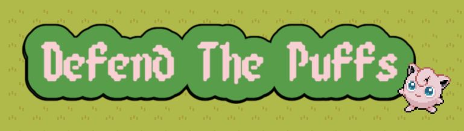

# Defend the Jiggly Puffs

----------------------------------------------

## Description

Defend the Jiggly Puffs is a fun and thrilling video game where the Demon Slayer uses a variety of weapons and skills 
to prevent waves of Demons from entering a village and eating the Jiggly Puffs.

The game is developed with JavaFX. The game uses the JDBC driver to connect to a local mysql instance for user registration and login.

### How to play:

Destroy all the incoming demons before they reach the Jiggly Puffs. Use your mana wisely.

#### Controls:
- Press `UP` to move the character up. 
- Press `DOWN` to move the character down.
- Press `LEFT` to move the character left.
- Press `RIGHT` to move the character right.
- Press `Z` to perform basic attack.
- Press `X` to perform slash attack.
- Press `C` to perform BLUE BLAST.

## Features
1. Rich texture and graphics.
2. Fun game logic.
3. Secure user login.
4. Ability to pause and resume game.

---------------------------------

## How to run locally
#### Configure mySQL to enable the login function:
1. set username of your local mySQL instance to be "comp2522"
2. set the password to be "I was born in 1973"
3. create a database named `comp2522`
4. create a table named `users`
5. insert a (username, password) tuple into the users table

#### Build with Maven

---------------------------------

## Dependencies
1. JavaFX
2. JDBC Driver
3. Simple Json

---------------------------------

## Credits
- Sprite Images for the demons and attacks: http://rosprites.blogspot.com/
- Sprite images for the playable character: https://www.kindpng.com/imgv/xRhJhx_the-legend-of-zelda-clipart-zelda-snes-zelda/
- Sprite images for the Jiggly Puffs: 

---------------------------------
## License

DefendTheAnimal is available under the MIT license. See the LICENSE file for more info.
